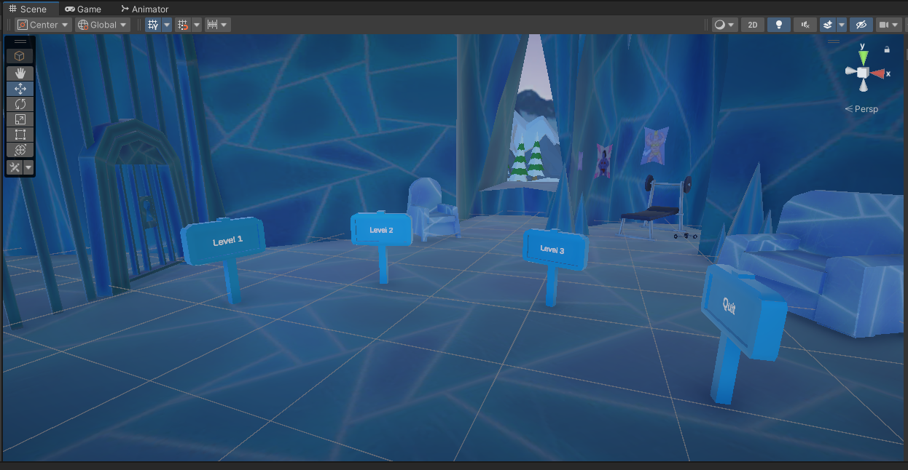
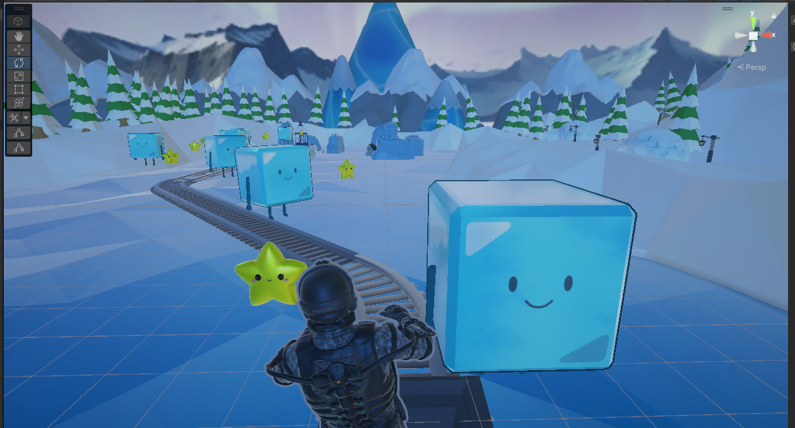
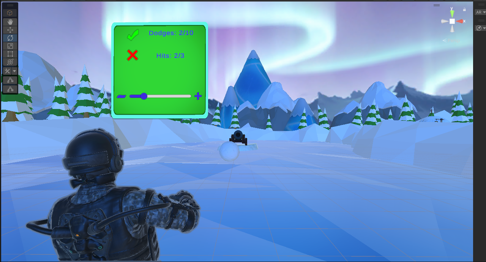
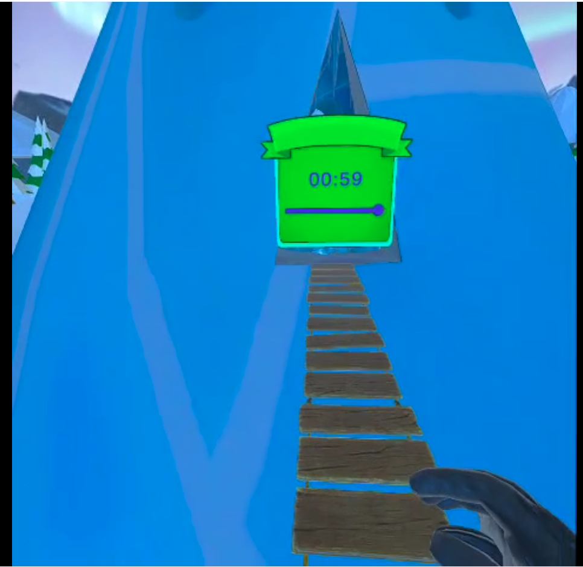

# Penguin Parade

> A body‑tracked VR rescue adventure for the Meta Quest 3.

[](https://unity.com/releases/editor/whats-new/2022.3.56)
[](https://docs.unity3d.com/Packages/com.unity.render-pipelines.universal@14.0/)
[](https://www.meta.com/quest/quest-3/)
[](https://developers.meta.com/horizon/downloads/package/meta-xr-sdk-all-in-one-upm)
[](https://github.com/oculus-samples/Unity-Movement)
[](LICENSE)
[](#source-code-access)

> **This is a portfolio showcase.** The full Unity source code is kept private. This repository hosts the README, screenshots, and the full internship report so visitors can see what Penguin Parade is and how it was built. To play the game, grab the **APK from the Releases tab**. To discuss the source, see [Source code access](#source-code-access) below.

## Description

**Penguin Parade** is a single‑player VR game in which the player rescues a penguin trapped across three icy challenges. The defining design choice is that **the player's body is the controller**: leaning, ducking, and balancing — captured by Meta's Movement SDK — drive every interaction, instead of the usual thumbstick locomotion. The project was built as a portfolio piece to demonstrate end‑to‑end VR development on Meta Quest: body‑tracking input, comfort‑first level design, and a stable 72 FPS budget.

## Tech Stack

| Category | Tool / Version |
|---|---|
| Engine | **Unity 2022.3.56f1** (LTS) |
| Render pipeline | Universal Render Pipeline 14.0.11 |
| VR / XR SDK | **Meta XR All‑in‑One SDK 60.0.0** |
| Body tracking | **Meta Movement SDK 4.3.0** |
| XR plumbing | XR Interaction Toolkit 2.6.4 · XR Management 4.5.1 · Oculus XR Plugin 4.5.1 |
| Gameplay packages | Unity Splines 2.7.2 (minecart track) · Timeline 1.7.6 · Visual Scripting 1.9.4 |
| UI | TextMeshPro 3.0.7 |
| Asset pipeline | Blender (source `.blend` meshes) · FBX Importer 4.2.1 · glTFast |
| Languages | C# (Unity), HLSL/ShaderGraph |
| Target device | **Meta Quest 3** (Android) — also runs over Link / Air Link for PCVR debugging |

## Key Features

- **Body‑tracking as primary input.** Hip and torso transforms from the Meta Movement SDK drive every lean/dodge/balance check. No joystick locomotion. A shared `PlayerBalanceController` calibrates a neutral pose on Start and dynamically syncs the player's capsule collider to the tracked hips, so physics matches where the body actually is in space.
- **Level 1 — Minecart Ride.** A Unity Splines track drives a cart along an icy mountain route; the player leans to dodge obstacles, and the rail decelerates near the rescue point for a cinematic finish. Singleton `GameManager` handles score, hit count, and win/fail UI.
- **Level 2 — Snowball Dodge.** Stationary‑play arena: alternating left/right snowball cannons force real lateral leans. A dedicated dodge‑validation system distinguishes a genuine dodge from being grazed, and a HUD tracks `Dodges X/10` vs `Hits X/3`.
- **Level 3 — Rope Bridge Crossing.** Timed balance challenge across a narrow plank bridge. Falling off or running out of time triggers a fade-to-black and a clean scene restart; reaching the end plays a win sound and transitions back to the hub.
- **Comfort‑first design.** Seated or stationary play in Levels 1 and 2, no artificial locomotion, and a target of **72 FPS minimum** on Quest 3 — both choices made to avoid motion sickness, per the comfort guidelines covered in the report.
- **Self‑contained per‑level managers** for audio, music, UI panels, and screen fading keep the three game scenes consistent without coupling them.

## Screenshots

| Main Menu — hub room | Level 1 — Minecart Ride |
|---|---|
|  |  |

| Level 2 — Snowball Dodge | Level 3 — Rope Bridge Crossing |
|---|---|
|  |  |

## Demo

[](https://youtube.com/shorts/bfN6id-ItBo)

▶ **[Watch the gameplay demo on YouTube](https://youtube.com/shorts/bfN6id-ItBo)**

## How to Try It

The simplest way to play is to **side‑load the prebuilt APK** onto a Meta Quest 3:

1. Download `Penguin-Parade.apk` from the [Releases](../../releases) tab of this repository.
2. Put your Quest 3 into [developer mode](https://developers.meta.com/horizon/documentation/native/android/mobile-device-setup/) and connect it over USB.
3. Install with [SideQuest](https://sidequestvr.com/) (drag and drop the APK) **or** with `adb`:
   ```bash
   adb install Penguin-Parade.apk
   ```
4. Launch the app from the headset's *Unknown Sources* library.

> A Meta Quest 3 is required for full body‑tracking fidelity (Movement SDK 4.3 features). Earlier Quest devices may run the game but with reduced tracking quality.

## Project Report

The full internship report — context, methodology, UML diagrams, technology choices, implementation notes, and testing — is available as a PDF:

📄 [**`docs/RapportDeStage.pdf`**](docs/RapportDeStage.pdf)

## Source Code Access

The Unity source code, scenes, and assets are kept in a private repository. If you are a recruiter, hiring manager, or collaborator and would like to discuss the code:

- 📧 Reach me at **anwerbouharb01@gmail.com**
- 💼 *(LinkedIn / portfolio site links — add yours)*

I'm happy to walk through specific systems (body‑tracking pipeline, level managers, comfort/performance tuning) on a call, share targeted code excerpts, or grant private‑repo access on a case‑by‑case basis.

## Credits / Context

- **Project:** End‑of‑internship project at **Inherited Games Studio** — a VR/AR studio focused on educational and entertaining immersive experiences.
- **Academic context:** Internship validated for **EPI Digital School**.
- **Duration:** 2 months (2025 — see [`docs/RapportDeStage.pdf`](docs/RapportDeStage.pdf) for the full report).
- **Author:** Anwer Bouharb — design, programming, integration, and build.
- **Third‑party SDKs:** Meta XR All‑in‑One SDK, Meta Movement SDK ([Oculus Samples — Unity-Movement](https://github.com/oculus-samples/Unity-Movement)), Unity Splines.

## License

This repository — README, screenshots, report — is published under the **MIT License** ([`LICENSE`](LICENSE)).
The Unity source code (private) is **all rights reserved** unless otherwise agreed in writing.
